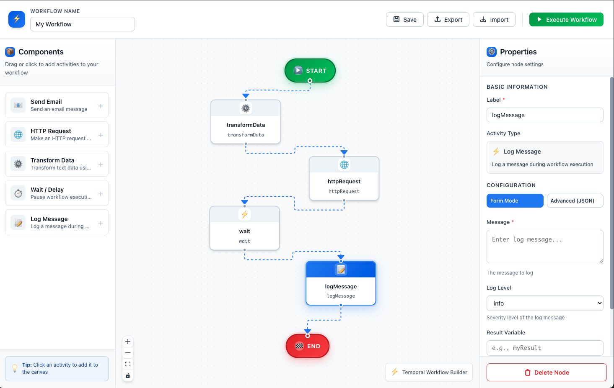
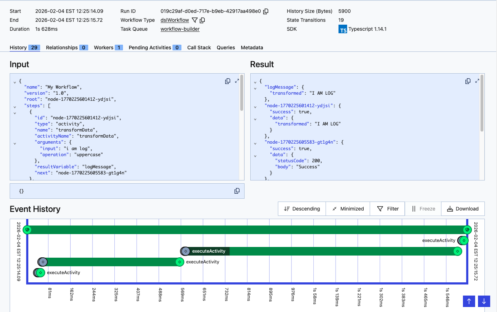

# Temporal Visual Workflow Builder

A full-stack TypeScript application for visually creating and executing Temporal workflows using drag-and-drop, with YAML import/export capabilities. The workflow is executed with a single defined activity that dynamically executes a function call based on the contents of the UI.



## Project Structure

```
temporal-workflow-builder/
├── frontend/                 # React + TypeScript frontend
│   ├── src/
│   │   ├── components/      # React components
│   │   ├── hooks/           # Custom React hooks
│   │   ├── utils/           # Utility functions (serialization, deserialization)
│   │   ├── types/           # TypeScript type definitions
│   │   └── App.tsx          # Main app component
│   └── package.json
│
├── backend/                  # Node.js + Express backend
│   ├── src/
│   │   ├── api/             # Express routes
│   │   ├── temporal/        # Temporal SDK setup
│   │   │   ├── client.ts    # Temporal client
│   │   │   ├── workflows/   # Workflow definitions
│   │   │   └── activities/  # Activity implementations
│   │   └── types/           # TypeScript types
│   └── package.json
│
├── shared/                   # Shared types
│   └── types/
│       └── workflow-schema.ts
│
└── README.md
```

## Technology Stack

### Frontend
- React 18+
- TypeScript
- React Flow (for visual workflow canvas)
- Axios (HTTP client)
- js-yaml (YAML processing)
- Zustand (state management)

### Backend
- Node.js 18+
- Express.js
- Temporal SDK (@temporalio/client, @temporalio/worker)
- TypeScript
- Zod (validation)

## Prerequisites

- Node.js 18+
- npm or pnpm
- Temporal Server running locally (see setup below)

## Setup Instructions

### 1. Install Dependencies

```bash
# Frontend
cd frontend
npm install

# Backend
cd ../backend
npm install
```

### 2. Start Temporal Server

Using Temporal CLI:
```bash
temporal server start-dev
```

Or using Docker:
```bash
docker run -p 7233:7233 -p 8233:8233 temporalio/auto-setup:latest
```

The Temporal Web UI will be available at: http://localhost:8233

### 3. Start Backend Services

```bash
cd backend

# Start the Temporal Worker
npm run worker

# In another terminal, start the API server
npm run dev
```

API Server will run on: http://localhost:3001

### 4. Start Frontend

```bash
cd frontend
npm run dev
```

Frontend will run on: http://localhost:5173

## How to Use

### Creating a Workflow

1. **Open the frontend**: Navigate to http://localhost:5173
2. **Name your workflow**: Enter a name in the "Workflow Name" field
3. **Add activities**: Click activity buttons in the left panel to add steps
4. **Connect steps**: Drag from the output handle of one node to the input handle of another
5. **Configure activities**: Click on a node to view/edit its properties

### Available Sample Activities

- **sendEmail**: Send an email (to, subject, body)
- **httpRequest**: Make HTTP requests (url, method)
- **transformData**: Transform data (input, operation: uppercase/lowercase/reverse)
- **wait**: Pause workflow execution (seconds)
- **logMessage**: Log messages (message, level)

### Exporting Workflows

Click "Export YAML" to download your workflow as a YAML file. Example format:

```yaml
name: Email Notification Workflow
description: Send email after data transformation
version: '1.0'
root: step-1
steps:
  - id: step-1
    type: activity
    name: Transform User Data
    activityName: transformData
    arguments:
      input: '${userName}'
      operation: uppercase
    resultVariable: transformedName
    next: step-2
  
  - id: step-2
    type: activity
    name: Send Welcome Email
    activityName: sendEmail
    arguments:
      to: user@example.com
      subject: Welcome!
      body: 'Hello ${transformedName}'
```

### Importing Workflows

Click "Import YAML" and paste your YAML workflow definition to load it into the editor.

### Executing Workflows

1. Design or load your workflow
2. Click the green "Execute" button
3. You'll receive a workflow ID and run ID
4. View execution details in the Temporal Web UI at http://localhost:8233

## API Endpoints

### Health Check
- `GET /api/health` - Server health status

### Workflow Execution
- `POST /api/workflow/execute` - Execute a workflow from definition
  ```json
  {
    "workflowDefinition": { /* workflow definition */ },
    "input": { /* optional input variables */ }
  }
  ```

- `GET /api/workflow/result/:workflowId` - Get workflow execution result

### Available Activities
- `GET /api/workflow/activities` - List all registered activities

## Adding Custom Activities

1. Create a new activity function in `backend/src/temporal/activities/sample-activities.ts`:

```typescript
async function myActivity(args: Record<string, any>): Promise<ActivityResult> {
  const { param1, param2 } = args;
  // Your implementation
  return {
    success: true,
    data: { /* result */ },
  };
}
```

2. Register it in the `registerSampleActivities` function:

```typescript
activityRegistry.register('myActivity', myActivity);
```

3. The activity will now appear in the frontend's activity palette

## Workflow Definition Format

A workflow definition consists of:

- **name**: Workflow name
- **description**: Optional description
- **version**: Version number (e.g., "1.0")
- **root**: ID of the starting step
- **steps**: Array of step definitions

Each step has:
- **id**: Unique step identifier
- **type**: Step type (activity, sequence, parallel, condition)
- **name**: Display name
- **activityName**: For activities, the activity function name
- **arguments**: Activity arguments (supports variable references like `${variableName}`)
- **resultVariable**: Optional variable name to store the result
- **next**: ID of the next step (for sequential flows)
- **branches**: IDs of parallel branches
- **onSuccess/onFailure**: For conditional branching

## Variable References

Variables can be referenced in activity arguments using the syntax: `${variableName}`

Example:
```yaml
arguments:
  email: ${userEmail}
  name: ${firstName}
```

## Development

### Frontend Development
```bash
cd frontend
npm run dev      # Start dev server
npm run build    # Build for production
npm run preview  # Preview production build
```

### Backend Development
```bash
cd backend
npm run dev      # Start with nodemon
npm run worker   # Start worker separately
npm run build    # Build to dist/
npm run start    # Start production build
```

## Troubleshooting

### Workflow won't execute
1. Ensure Temporal Server is running (`temporal server start-dev`)
2. Ensure backend worker is running (`npm run worker`)
3. Check that API server is running (`npm run dev`)
4. Verify workflow definition is valid (all referenced steps exist)

### Activities not showing up
1. Check backend logs for activity registration errors
2. Ensure activities are registered in `registerSampleActivities()`
3. Call `GET /api/workflow/activities` to verify they're available

### CORS errors
1. Verify backend has CORS enabled (it does by default)
2. Check that frontend is calling correct API URL (http://localhost:3001/api)
3. Verify backend is running on port 3001

### Temporal connection issues
1. Check Temporal Server is running on localhost:7233
2. View Temporal Web UI at http://localhost:8233 for server health
3. Check backend logs for connection errors

## Performance Considerations

- Workflows are stored in Temporal's event sourcing system
- Frontend performs in-memory state management
- Backend uses activity registry for efficient lookups
- Support for parallel and sequential step execution

## Security Notes

⚠️ This is a development/demo application. For production use:

1. Add authentication and authorization
2. Validate all workflow definitions
3. Implement rate limiting
4. Use secure Temporal Cloud configuration
5. Add input sanitization
6. Implement activity permission checks
7. Add comprehensive error handling and logging

## Conditional Workflows

The system supports conditional branching to create dynamic workflows based on runtime values.

### Creating a Condition Node

1. Click the **Condition** button in the Control Flow section
2. Configure the condition:
   - **Variable**: The variable name to check (from previous steps)
   - **Operator**: Comparison operator (equals, notEquals, greaterThan, lessThan, etc.)
   - **Value**: The value to compare against
3. Connect the **left handle** (green) for the success path
4. Connect the **right handle** (red) for the failure path

### Supported Operators

- **equals (==)**: Value equality
- **notEquals (!=)**: Value inequality
- **greaterThan (>)**: Numeric greater than
- **lessThan (<)**: Numeric less than
- **greaterThanOrEqual (>=)**: Numeric greater than or equal
- **lessThanOrEqual (<=)**: Numeric less than or equal
- **exists (?)**: Variable is defined
- **notExists (!?)**: Variable is undefined

### Example: Conditional Approval Workflow

```yaml
name: Order Processing with Approval
description: Process orders with conditional approval step
version: '1.0'
root: step-1
steps:
  - id: step-1
    type: activity
    name: Check Order Amount
    activityName: transformData
    arguments:
      input: '${orderAmount}'
      operation: uppercase
    resultVariable: amount
    next: step-2
  
  - id: step-2
    type: condition
    name: Requires Approval?
    arguments:
      variable: amount
      operator: greaterThan
      value: 1000
    onSuccess: step-3  # Amount > 1000, needs approval
    onFailure: step-4  # Amount <= 1000, auto-approve
  
  - id: step-3
    type: activity
    name: Send Approval Request
    activityName: sendEmail
    arguments:
      to: manager@company.com
      subject: Approval Required
      body: 'Order amount: ${amount}'
    next: step-5
  
  - id: step-4
    type: activity
    name: Auto Approve Order
    activityName: logMessage
    arguments:
      message: 'Order auto-approved: ${amount}'
      level: info
    next: step-5
  
  - id: step-5
    type: activity
    name: Send Confirmation
    activityName: sendEmail
    arguments:
      to: customer@example.com
      subject: Order Confirmed
      body: 'Your order has been processed'
```

### Visual Representation

```
    [Start]
       ↓
 [Check Amount]
       ↓
  [Condition]
     ↙    ↘
✓Success  ✗Failure
    ↓        ↓
[Approval] [Auto]
    ↓        ↓
    └────┬───┘
         ↓
  [Confirmation]
         ↓
      [End]
```

## Future Enhancements

- Advanced workflow controls (retry policies, timeouts)
- Workflow versioning and migration
- More pre-built activity templates
- Workflow testing framework
- Compound conditions with AND/OR logic
- Real-time workflow status updates
- Workflow metrics and monitoring
- Activity timeout configuration
- Workflow pause/resume functionality

## License

MIT

## Support

For issues, questions, or contributions, please refer to the implementation plan document or create an issue in the repository.
